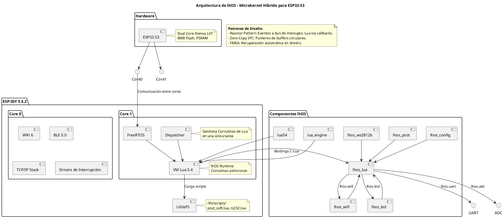

# Arquitectura de lhOS

## Descripción General

lhOS implementa una arquitectura híbrida de microkernel, combinando el poder de ESP-IDF y FreeRTOS con la flexibilidad de Lua 5.4 para scripting asíncrono. El sistema está dividido en dos cores para optimizar el rendimiento y la separación de responsabilidades.

### Componentes Principales
- **Hardware**: ESP32-S3 con dual core.
- **ESP-IDF**: Framework base para drivers y protocolos.
- **FreeRTOS**: RTOS para multitarea.
- **Lua VM**: Runtime para scripts de usuario.
- **LittleFS**: Filesystem para scripts persistentes.
- **Componentes lhOS**: Módulos específicos (lhos_lua, etc.).

### Diagrama de Arquitectura

### Patrones de Diseño
- **Reactor Pattern**: El código C notifica eventos al bus de mensajes; Lua reacciona mediante callbacks no bloqueantes.
- **Zero-Copy IPC**: Transferencia de datos entre procesos usando punteros de buffers circulares.
- **FMEA (Failure Mode and Effects Analysis)**: Drivers implementan recuperación automática ante fallos de hardware.

### Memoria y Asincronía
- Heap de Lua en PSRAM para eficiencia.
- Dispatcher central para coroutines, evitando múltiples tareas FreeRTOS por script.